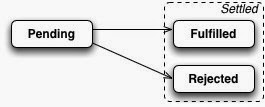

# Promises

## Heap, Stack frame, Event Loop ... oh my 

http://prkr.me/words/2014/understanding-the-javascript-event-loop/

Javascript Engine runs your code in a single(!) thread. 

When function ```f()``` is called, JS Engine creates a stack frame containing function arguments and local variables. 
The allocated object live in the Heap.
JS Engine also has a Queue of messages. Each message has a function associated to it.

How the messages in the queue are invoked? The event loop takes care of it!

```Javascript
while (queue.waitForAMessage()) {
  processTheMessage();
}
```
```Javascript
processTheMessage() {
  createStackFrameForAssociatedFunction();
  passFunctionArguments();
  invokeFunction();
  dropTheStackFrame();
}
```

Important: each message is processed completely before any other message is processed!

- Good: your code runs in one thread, can't be pre-empted, no concurrency problems.

- Bad: nothing else goes, while your code is running. So if your code takes too long to complete, the application gets unresponsive.

What creates a new message?
In web browsers a message is added any time an event occurs that has an event handler attached to it.

A call of ```setTimeout``` or ```setInterval``` also creates a message.

The main message is: make sure your code won't block!


## Callbacks
Simplest thing that works. But:

- no consistent API
- 'this' is not easy to track
- need error handling for each step

You end up in the callback hell:

```Javascript
getUser(userId, function(err, user) {
  if (err) return handleError(err);

  getCategory(user, function(err, category) {
    if (err) return handleError(err);

    getRecommendations(category, function (err, articles) {
      if (err) return handleError(err);

      // do something useful
      articles.forEach(function (article) {
        console.log('Hey buddy, buy one of these: ', article.name);
      });

    });
  });
});
```


## Promise to the rescue

A promise represent the result of asynchronous operation that will be completed sometime in the future. 
At the minimum, a promise is a JavaScript object with a then function.

A Promise has 3 mutually exclusive states:

- pending (result has not been calculated yet)
- fulfilled (result calculated successfully)
- rejected (a failure occurred)

Once the promise is fulfilled or rejected it is immutable.



### Creating a promise

```Javascript
let somePromise = new Promise(
  function(resolve, reject) {
    if (someCondition)
      resolve(someData); // success, send the result via resolve callback
    else
      reject(someReason); // failure, notify the consumer
  }
);
```

### Consuming a promise

```Javascript
somePromise.then(
  function(data)   { /* success callback */ },
  function(reason) { /* failure callback */ }
);
```

If you only care about success (as I do) then omit second callback:

```Javascript
somePromise.then(function(data) {
  // do something with data
});
```

If you are interested in failures only (like Dart fans):

```Javascript
somePromise.then(
  null,
  function (reason) { /* do something */ }
);
```

ES6 Promises have a nice shortcut for error handling:

```Javascript
somePromise.catch(
  function(reason) { /* your error handling code */ }
);
```

To wrap a value in a promise there are 2 utility methods:

```Javascript
Promise.resolve(100);
Promise.reject('Ups!');
```

### Chaining promises

When resolving (or rejecting) a promise, there are situation where you want to use a result of another asynch. operation (another promise):

```Javascript
asynch1().then(result => {
  asynch2().then(result => {
   // even deeper ?
  });
});
```
A promise lets you flatten the pyramid of doom easily. If you return something thenable, the next then() will wait until that thenable settles.

```Javascript
asynch1()
.then(resultOfAsynch1 => {
  return asynch2();
})
.then(resultOfAsynch2 => {
  return asynch3();
})
.then(resultOfAsynch3 => {
  console.log('finally got this', resultOfAsynch3)
})
.catch(someError => {
  console.log('Got error:', someError);
});
```
// TODO: Image Hartman2

### Promise.race

If you have multiple methods all running simultaneously and only want to have the result of the first one that settles (either resolve or reject) use Promise.race:

```Javascript
Promise.race(arrayOfPromises)
  .then(firstResolved => {
    //  Houston, Tranquility Base here. The Eagle has landed.
  })
  .catch(firstRejected => {
    // Houston, we have a problem.
  });
```
Nice, but what would be the real use case? (Hint: timeout ajax call)

### Promise.all

If you want to wait for all promises to resolve, use Promise.all. The then() gets an array of resolved values:

```Javascript
Promise.all(arrayOfPromises)
  .then(arrayOfResolves => {
    arrayOfResolves.forEach(result => {
      // Do something useful
    });
  })
  .catch(err => {
    // Huston, we have a problem.
  });
```